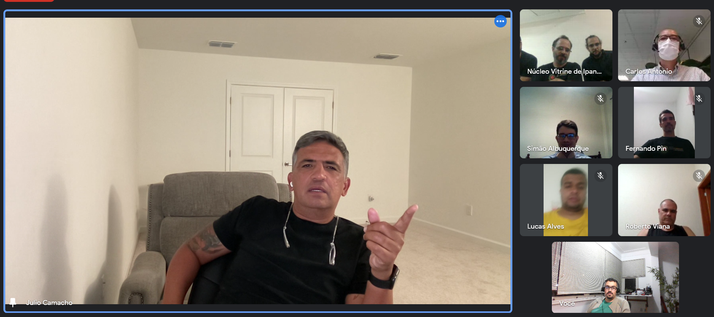

Temos feito uma série de encontros sobre temas fundamentais para nossa família, no de hoje,  falava sobre como a transmissão do sistema precisa ser completa e me lembrei de uma história sufista:

Três morcegos cegos se encontravam um elefante pela primeira vez.

O primeiro tentou passar por baixo do elefante e quase foi pisoteado:

— *"Cuidado! O elefante é um pilar gigante ponto para te esmagar!"*

O segundo passou próximo a tromba:

— *"Não! o elefante é um tubo flexível, deve ser uma cobra! vai dar o bote a qualquer momento!"*

O terceiro, mais calmo, pousou nas costas do elefante:

— *"Calma! o elefante é uma cama quente e dura. Vamos descansar?"*

A história é simples, mas tenta ensinar algo que ignoramos constantemente:

***Um sistema não pode ser entendido analisando suas partes isoladamente.***

***

E você? preparado para ter acesso completo ao sistema Ving Tsun? Procure um dos centros de transmissão do .

***

