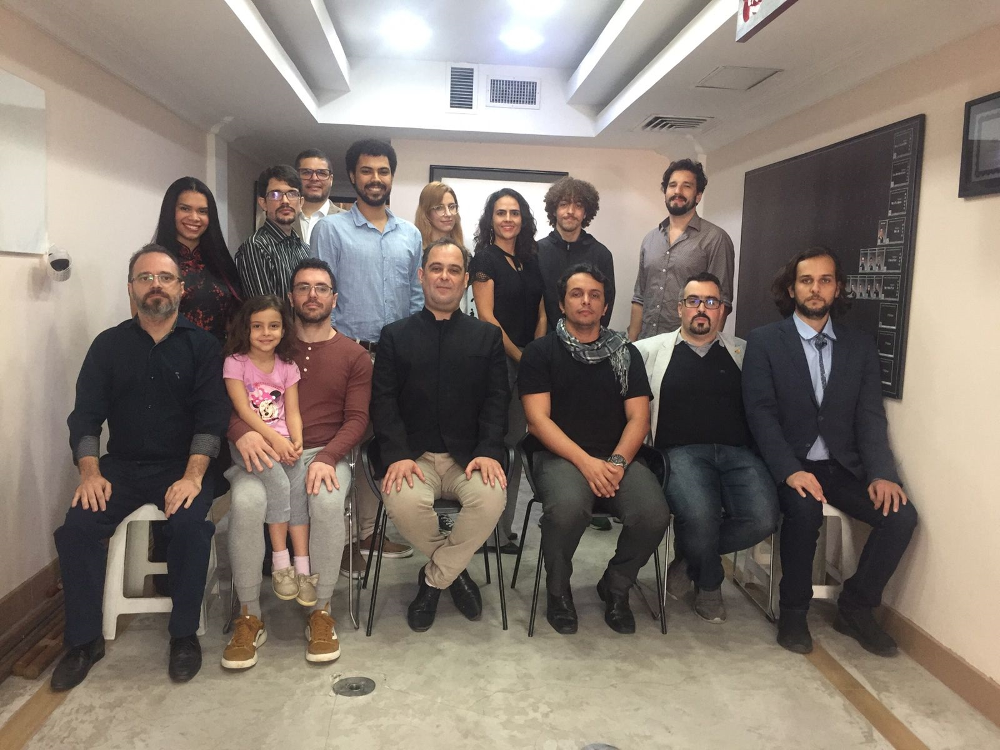

Neste sábado, 2022-09-17, fizemos um Open House no [centro de tramissão de Ipanema](https://mestrejuliocamacho.com/os-centros/) e na Abertura do Sam Toi, [Si Fu](http://mestrejuliocamacho.com "Mestre Julio Camacho") nos falava como, apesar de nossa pratica não ser religiosa, certos ensinamentos do budismo acabam fazendo parte do nosso dia-a-dia.

Dado o momento atual ele comentava sobre as 3 verdades universais do Budismo:

1. **Insubstanciabilidade:** As coisas não tem uma substancia nelas próprias; Si Fu citou o paradoxo do barco de Teseu: "se trocarmos todas as peças do barco de Teseu, uma a uma, o barco deixa de ser dele? Se montarmos um outro barco ao lado com as peças trocadas, temos dois barcos de Teseu?"
2. **Sofrimento:** Você irá sofrer. Não importa o que faça, a condição humana é de sofrimento. Estamos no caminho do aperfeiçoamento, o caminho do Kung Fu, não há como escapar dessa verdade;
3. **Impermanência:** Nada é permanente, tudo está em constante mudança. O exemplo que ele usou foi do morro Dois Irmãos em Ipanema: Não é porque ele está lá agora, estava lá a 200 anos, estará daqui a 100 anos que ele é permanente. Na verdade, considerando a história da Terra ele está lá por apenas uma pequena fração de tempo e logo irá desaparecer.

Normalmente a disposição dessas verdades é invertida, entretanto Si Fu deslocou a impermanência para poder falar das diversas mudanças simultâneas que estamos passando.

Uma das primeiras leituras que aprendi para o Ving Tsun [永春](https://www.mdbg.net/chinese/dictionary?page=chardict&cdcanoce=0&cdqchi=%E6%B0%B8%E6%98%A5) seria: "Celebrar a Mudança"; Está no nosso "DNA", no nosso [Kung Fu 功夫](../etimologia-kung-fu); Tudo irá mudar e uma das habilidades que mais treinamos é como lidar com isso.

***

E você? quer desenvolver sua habilidade de lidar com o inesperado? Procure um dos centros de transmissão do [Instituto Julio Camacho](https://mestrejuliocamacho.com).

***

**Sigamos Juntos!**

***

> *"Não há mal que sempre dure, nem bem que nunca se acabe"*
>
> ~ Minha avó, mas certamente alguém falou antes dela
