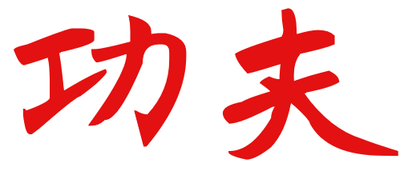

Em um Encontro com Mestre Julio Camacho, Matheus Azevedo propôs que se falasse sobre Kung Fu ([功夫](https://www.mdbg.net/chinese/dictionary?page=chardict&cdcanoce=0&cdqchi=%E5%8A%9F%E5%A4%AB)), um tema que daria uma vida inteira de conversas, [Si Fu](http://mestrejuliocamacho.com "Mestre Julio Camacho") optou por começar sobre a etimologia do termo pelos seus dois ideogramas:

O primeiro ideograma [功](https://www.mdbg.net/chinese/dictionary?cdqchi=%E5%8A%9F) (gōng em mandarim e gung1 em cantonês - lido erroneamente como "kungui"), é formado por dois outros: [工](https://www.mdbg.net/chinese/dictionary?cdqchi=%E5%B7%A5) (gōng - mesma leitura),  faz referência ao trabalho propriamente dito ou ao esforço, muitas vezes intelectual, para executar uma tarefa e [力](https://www.mdbg.net/chinese/dictionary?cdqchi=%E5%8A%9B) (lì/lik6) que pode ser traduzido literalmente como energia, remetendo ao desenho de um arado de terra. A junção dos dois passa a ideia de uma realização por mérito, um bom resultado por meio de um trabalho árduo ou dedicado.

O segundo ideograma é [天](https://www.mdbg.net/chinese/dictionary?cdqchi=%E5%A4%A9)  (fū / fu1), é formado por [大](https://www.mdbg.net/chinese/dictionary?cdqchi=%E5%A4%A7) (dài/daai6) que seria uma grande pessoa e com uma presilha nos cabelos em referência à como os homens casados (ou maduros) prendiam o cabelo na china antiga.

Logo, Kung Fu poderia ser lido como o processo de amadurecimento por meio do trabalho (árduo). Sendo notável que não haja nada relativo a artes marciais quando analisado por seus ideogramas. [Si Fu](http://mestrejuliocamacho.com "Mestre Julio Camacho") sempre nos orienta a desenvolver Kung Fu em qualquer atividade. Mas porque então o termo é tão associado ao combate? Um dos motivos é a premência de morte, que também terá algumas palavras aqui no momento oportuno. 

***

E você? quer desenvolver seu próprio Kung Fu? Procure um dos centros de transmissão do [Instituo Julio Camacho](https://mestrejuliocamacho.com/os-centros/).
