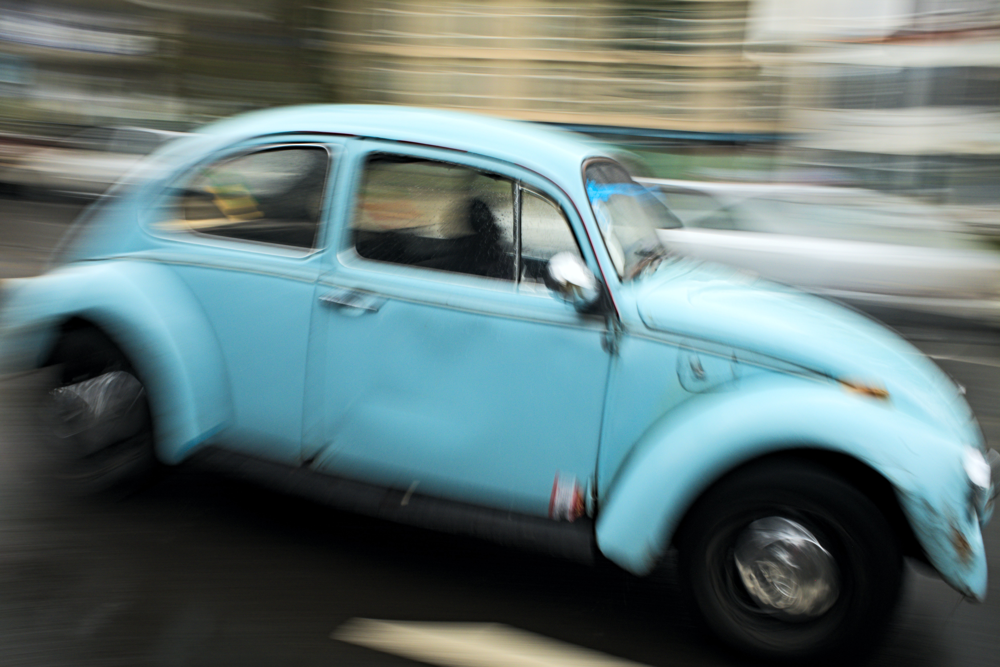

Ainda durante o Open House no [centro de transmissão de Ipanema](https://mestrejuliocamacho.com/os-centros/) semana passada, [Si Fu](http://mestrejuliocamacho.com "Mestre Julio Camacho") ao falar sobre a [insubstancialidade](../3-registros-da-existencia) citou um exemplo do Si Baak Juscelito:

> "Se eu tenho um carro, e tiro as 4 rodas ele ainda é um carro?"
> 
> "E se tirarmos o volante?"
> 
> "E se tiramos as portas?..."

A história segue, cada vez temos menos carro, porém ainda nos referimos às peças restantes como um veículo.

A conclusão é que as coisas não existem por si só.  Nós é que atribuímos valor e damos substância a tudo - inclusive um diferencial de um bom praticante de Kung Fu ([功夫](https://www.mdbg.net/chinese/dictionary?page=chardict&cdcanoce=0&cdqchi=%E5%8A%9F%E5%A4%AB)) é a capacidade de ver além do óbvio.

Um ponto interessante é que a primeira vez que ouvi essa história foi a mais de 15 anos. Si Fu provocava uma sonolenta Jade enquanto a levava para o colégio. Eu ia no banco do carona ouvindo muitas vezes sem entender. O que me pergunto agora é se o Si Fu estava de fato falando para ela, ou a usando para me contar;

Enfim, isso se tornou um hábito que trouxe para minha família: sempre que podemos estamos conversando sobre aleatoriedades, tudo é passível de questionamento e todo conhecimento é bem-vindo.

Disso temos mais algumas historietas relacionadas à destruição de carros:

***

### A Desconstrução

Quando nos mudamos para Petrópolis as meninas descobriram uma nova brincadeira: Sempre que uma avistasse um fusca primeiro, ela indicaria __"Fusca!"__ e daria uma catucada na outra.

Depois alguns excessos de ambas as partes eu aderi ao esporte (de forma *“pedagógica"*) e após apenas algumas intervenções (*“educativas”*) elas tornaram a brincadeira mais civilizada: Ao ver um fusca elas simplesmente indicavam e somavam pontos de acordo com cores e outros critérios (muitas vezes duvidosos).

Isso se tornou nosso pequeno jogo para nos distrairmos em viagens mais longas, com o tempo fizemos variações para outros ambientes e se tornou um bom treino de atenção e de estar em guarda.

Numa viagem numa pequena cidade no interior do Rio a quantidade de fuscas era até grande, entretanto em sua maioria estavam fora das ruas principais, como eu estava dirigindo eu perdia para ambas por não poder vê-los.

Como a situação estava crítica avistei uma Kombi e falei: - *__"Fusca!"__*

Ambas se queixaram: - *__"Papai! Isso não é um fusca!"__*

Respondi com ar sabichão: - ***"Ué! A Kombi foi criada pelos alemães combinando o motor do Fusca com um veículo de carga - então tem um fusca ali dentro".*** Elas reclamaram, mas me deram meio ponto de consolação.

Mais à frente vi uma carroça e falei novamente: ***"Fusca!"*** 

Novos protestos vorazes. Comecei meu argumento com a história do Si Fu: - ***"Se eu tirar as rodas da frente do fusca, ele ainda é um fusca? se eu colocar um cavalo para puxar ele deixa de ser um fusca?"*** - Consegui mais meio ponto!

No fim, foi uma grande goleada delas, mas elas se divertiram bastante comigo tentando conseguir pontos com a lixeira na rua (*se eu jogar um monte de lixo no fusca?*), o cachorro que passava (*se o fusca tivesse patas?*), o pombo no poste (*se o fusca voasse?*)...

***

### O Fenômeno

Certo dia ao caminhar com minha filha mais nova, estávamos em meio àqueles silêncios constrangedores numa rua deserta, a catuquei para quebrar o gelo e falei: - ***"Fusca!"***

Ela contestou imediatamente: - ***"mas não tem nada aqui?!"***

Eu expliquei: - ***"No final da idade média um filósofo chamado Hegel falou que tudo que existe é fruto dos sentidos, ele criou a Fenomenologia"***

Ela me olhou ainda incrédula, recebera uma catucada gratuitamente.

Continuei: - ***"Pensa bem. Ao olhar um fusca na rua a imagem se forma na sua mente. Da mesma forma, quando você imagina um fusca a imagem surge na sua cabeça. Qual diferença entre o fusca que existe do lado de fora e o fusca perfeito de dentro da sua mente?"***

Ela virou os olhos, já sabia que eu não ia parar. Entrei numa outra explicação: - ***"Inclusive, o fusca ideal, segundo Platão..."***

Simplesmente acabou o silêncio daquela caminhada, ela ria e retrucava os absurdos já sabendo que no caso de outro silêncio uma nova catucada (*“pedagógica”*) poderia acontecer a qualquer momento. Foi um bom treino de guarda para ela.

***

### O Desvanecer

Num trajeto longo, competíamos novamente por quem encontraria mais fuscas, a competição era séria: Os perdedores pagariam um belo sorvete para o vencedor.

Ao chegar no final do trajeto, a minha filha mais velha estava à frente por 2 ou 3 pontos. 

Entramos na sorveteria e a mais nova falou: - ***"Sabe o que acontece? Imaginei um estacionamento cheio de fuscas, logo tenho 50 pontos a mais que vocês e ganhei"***

A mais velha retrucou: - ***"verdade..., mas agora que você falou do estacionamento de fuscas, pensei na mesma coisa então empatamos - Papai paga o sorvete"***

Sorri e respondi: ***"Perderam! Quero aquele sorvete mais caro ali!"***

Elas me olharam reticentes sabendo que viria alguma manobra, continuei: ***"Meu estacionamento é só de fuscas azuis, tenho mais pontos que ambas".***

Apesar de eu ter "ganhado" paguei os sorvetes para conter a rebelião que se formava, só então elas aceitaram meus belos fuscas azuis estacionados.

***

Hoje muitas vezes falamos: ***"sabe o que pensei?"*** e já calculamos pontos e fuscas metafísicos (e sorvete!) automaticamente. 

Quando um silêncio se forma, uma catucada já nos remete aos fuscas imaginários, não raro o silêncio permanece com elas esperando de onde vem o próximo golpe.

E você preparado para ver além do óbvio? Procure um dos centros de transmissão do [Instituto Julio Camacho](https://mestrejuliocamacho.com).

***

**Fusca!**

> ***Sinta-se catucado!***